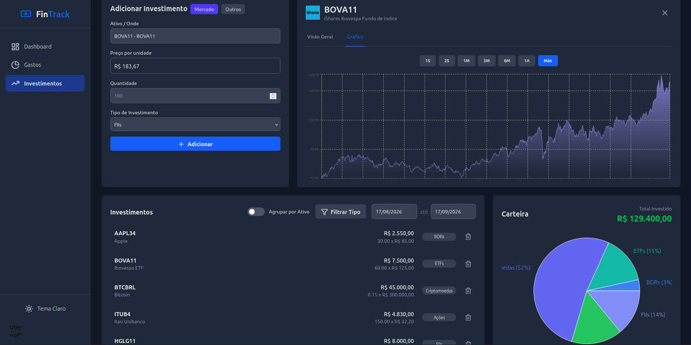

# 💰 fin-track (Monitor de Investimentos)

<p align="right">
  <a href="README.md">🇺🇸 English</a> | <strong>🇧🇷 Português</strong>
</p>

> [!WARNING]
> **Aviso de Status do Projeto**
> Esta aplicação não está mais em desenvolvimento ativo. Criei uma nova aplicação, o **[Zeno Cash](https://github.com/Droppicode/Zeno-Cash)**, totalmente focada em controle de gastos e monitoramento *offline* de transações, bancos e cartões de crédito. 
> 
> O *Finance-Tracker* (este repositório) ficou voltado exclusivamente para a parte de **investimentos**, utilizando a API da Brapi e GitHub Actions.

> **Seu dinheiro, suas regras.**  
> Monitore seu portfólio de investimentos e acompanhe as cotações em uma interface elegante e intuitiva.

<p align="center">
  
  
  
  
  
</p>

<p align="center">
  
</p>

---

## ✨ Recursos

- 💹 **Portfolio de Investimentos** — Acompanhe seus ativos com cotações em tempo real via API da Brapi
- 📊 **Análise de Ativos** — Visualize a distribuição do seu portfólio com gráficos interativos
- 🌙 **Modo Escuro** — Interface moderna que se adapta ao seu gosto
- 🔐 **Autenticação Segura** — Login via Google OAuth ou Email
- 📱 **Responsivo** — Funciona perfeitamente em qualquer dispositivo

## 🚀 Quick Start

### Pré-requisitos

- Node.js 18+
- Conta Firebase (gratuita)
- Conta GitHub (para GitHub Actions)
- Token da API Brapi

### Instalação

Este projeto está dividido em duas aplicações separadas: o frontend (`client/`) e o backend serverless (`api/`). Para rodar o projeto localmente, você precisará iniciar ambos.

**1. Configuração do Backend (Vercel Serverless API)**
```bash
# Clone o repositório
git clone https://github.com/Droppicode/Finance-Tracker.git
cd Finance-Tracker

# Instale a CLI da Vercel se ainda não tiver
npm i -g vercel

# Crie um arquivo .env na raiz do projeto para o backend:
# BRAPI_API_KEY=sua_chave_brapi
# GEMINI_API_KEY=sua_chave_gemini
# GITHUB_TOKEN=seu_token_github
# GITHUB_REPO_OWNER=seu_usuario_github
# GITHUB_REPO_NAME=Finance-Tracker

# Rode o backend localmente (iniciará em http://localhost:3000)
vercel dev
```

**2. Configuração do Frontend**
Abra uma nova aba no terminal:
```bash
cd Finance-Tracker/client

# Configure as variáveis de ambiente
cp .env.example .env

# IMPORTANTE: Edite seu client/.env para apontar para o backend local:
# VITE_API_BASE_URL=http://localhost:3000
# Preencha também suas credenciais do Firebase e Google Client ID.

# Instale as dependências e rode o frontend
npm install
npm run dev
```

🎉 Acesse `http://localhost:5173` e comece a monitorar seus investimentos!

## 🧪 Modo Recrutador / Teste

Quer testar a aplicação na prática sem ter que cadastrar nada na mão? Criamos um modo de **Acesso de Visitante**!
Basta clicar em **"Entrar como Visitante / Teste"** na tela de login. Você entrará em uma sessão limpa e isolada, onde poderá clicar no "Botão Mágico" para preencher o aplicativo instantaneamente com dezenas de dados fakes super realistas, incluindo:
- 📊 **Carteira Diversificada:** Ações, FIIs, ETFs, BDRs e Criptomoedas.
- 💸 **Transações:** Despesas e receitas espalhadas pelo mês atual e o mês anterior.
- 📅 **Datas Dinâmicas:** Os dados são sempre gerados em relação ao dia atual, garantindo que os gráficos de barras estejam sempre perfeitamente preenchidos, não importa quando você teste!

## 🏗️ Stack Tecnológica

| Camada      | Tecnologias                                                   |
|-------------|---------------------------------------------------------------|
| Frontend    | React 19, Vite, Tailwind CSS, Recharts, Lucide Icons         |
| Backend     | Firebase (Firestore, Auth), Vercel Functions (Serverless)    |
| Cloud       | GitHub Actions (data pipeline com Brapi API)                  |

## 📈 Dados Históricos de Ações

O fin-track usa um **pipeline automatizado** para buscar dados históricos de ações:

1. **Frontend** solicita dados e cria um documento "pending" no Firestore
2. **GitHub Actions** é acionado via repository dispatch
3. **Brapi API** busca dados históricos de ações da B3
4. **Firestore** armazena os dados com cache de 24 horas
5. **Frontend** exibe os gráficos instantaneamente

### Configuração

1. Crie uma conta de serviço no Firebase Console
2. Gere um token do GitHub com escopo `repo`
3. Obtenha um Token da Brapi
4. Adicione `FIREBASE_SERVICE_ACCOUNT` aos secrets do repositório
5. Configure `GITHUB_TOKEN` e `BRAPI_TOKEN` nas variáveis de ambiente do backend

Um workflow agendado atualiza os dados **diariamente às 2h UTC** para garantir informações sempre atualizadas. 🔄

## 📝 Licença

MIT © [Marcos]

---

<p align="center">
  Feito com ❤️ e ☕ • <a href="#-fin-track-monitor-de-investimentos">Voltar ao topo ↑</a>
</p>
